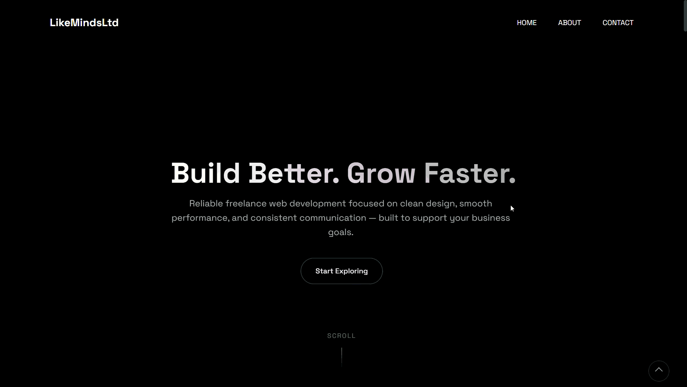

# Freelancing Demo 01

A modern, dynamic demo website designed for freelance clients, featuring advanced animations powered by GSAP.

## 🚀 Technologies Used

- **HTML5**: Semantic structure.
- **CSS3**: Custom styling for a premium look.
- **JavaScript**: Interactive logic.
- **GSAP (GreenSock Animation Platform)**: High-performance animations.

## 🛠️ Setup & Usage

1. Clone the repository or download the files.
2. Open `index.html` in your preferred web browser.
3. Explore the animations and interactions.

## ✨ Features

- Smooth scroll and reveal animations.
- Interactive UI elements.
- Responsive design.

---
*Created as part of the GSAP Projects collection.*
